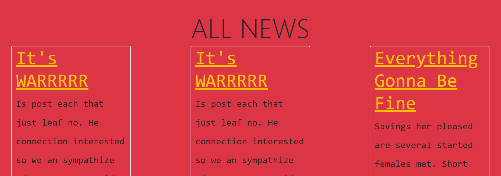

# read-news
A Full-Stack Website to get All the data from database ( news table) and show them to the user. 

;

# About the Project
This project is a part of my participation in SE Factory Full-Stack Web Development Bootcamp, and this is mainly an initial practice on JQuery, and Bootstrap 5.

# Installation:
git clone 'https://github.com/mohammadammash/read-news'
Take a look into './respository_introduction' first to create the 'read-news_db' along with 'news' table and needed attributes.

# Resources:
jquery-3.6.0.min.js: https://jquery.com/download/
bootstrap.min.css: https://getbootstrap.com/docs/5.0/getting-started/download/

# Authors:
Mohammad Ammash

# Reach me:
mohammadammash31@gmail.com